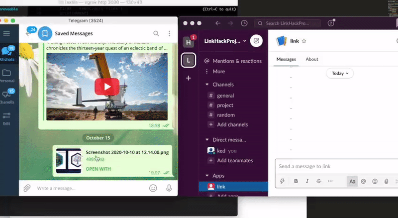

# slackTmShare

Share files from slack to telegram and vice versa. 

APOLLO hackathon project.

#### Existing problem:

On a desktop there is no easy way to share files between slack and telegram messengers.
You need to first download a file to your machine then open an application, find where the file was downloaded and attach it (at least 4 clicks).
On mobile devices there is share button you just click and choose where to share (at least 3 clicks). 

4 clicks such a waste of time, so clear problem here :)

#### Solution:

Have a common place to store data and have an interface through messengers' bots
Textile bucket is used as such storage and bots can push, pull and share data

#### Demo:

